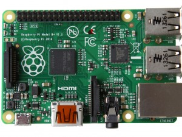
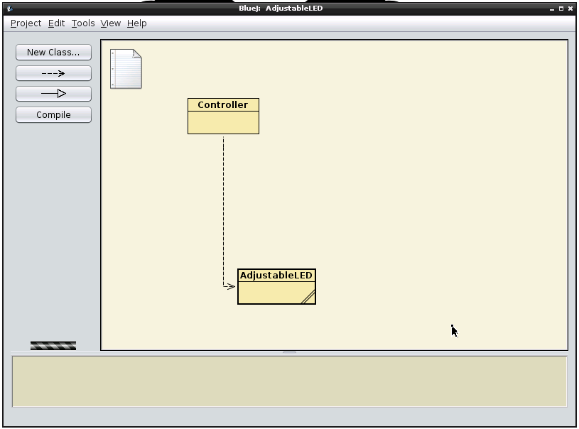
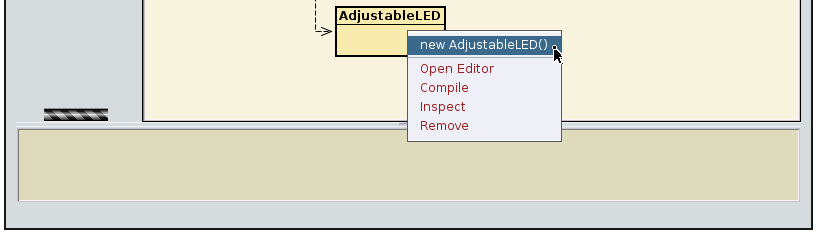
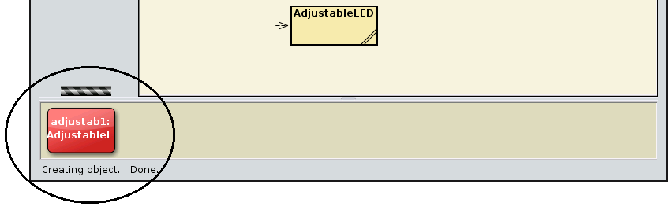
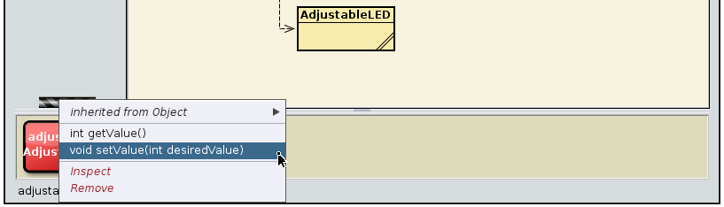
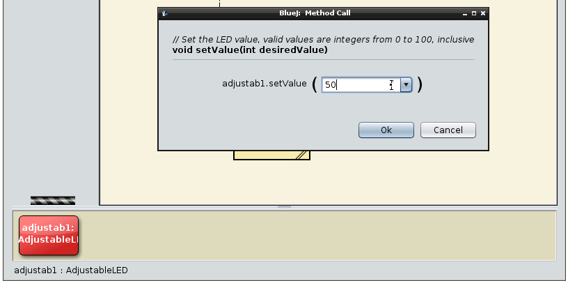
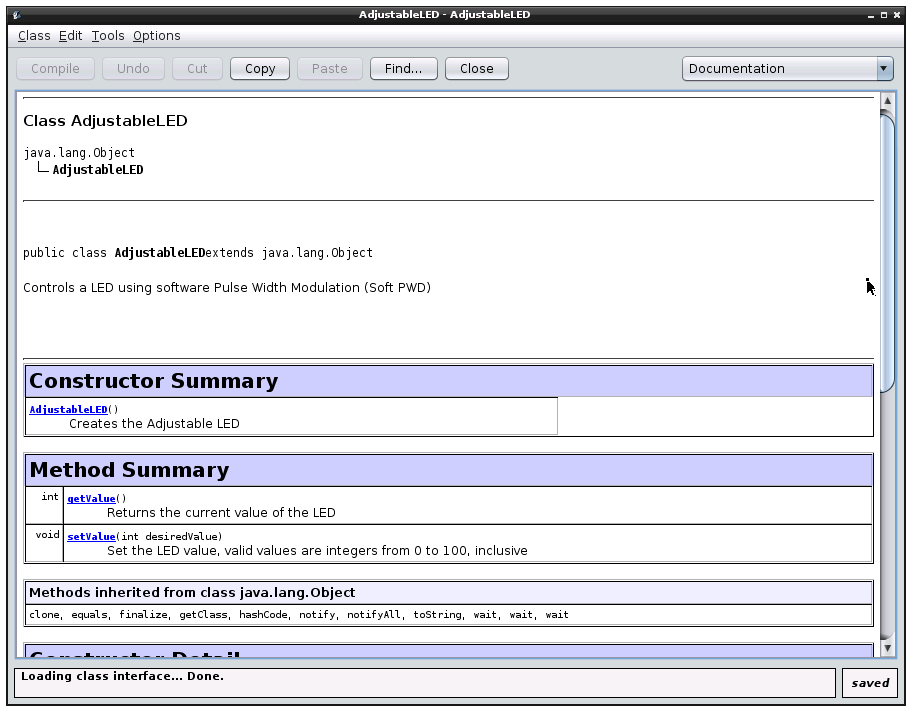
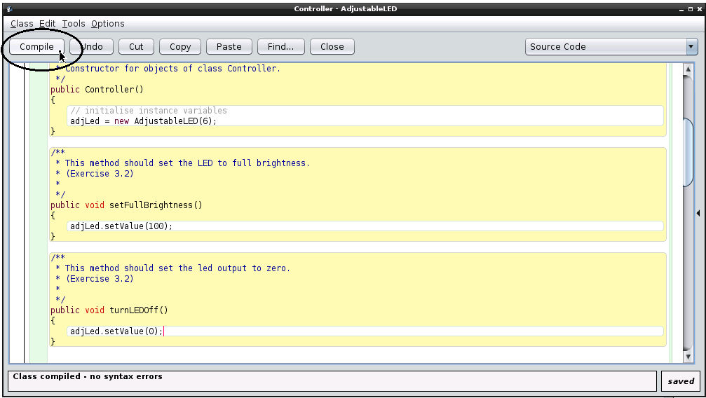

<h1 algin="center"> Adjustable LED Tutorial </h1>

This is a quick tutorial on how to use BlueJ on the Raspberry Pi to create a Soft PWM (Software Pulse Width Modulation) pin and use it to control a LED brightness. It is not intended to be a complete description of how to use the pins: for that, see the sections called <a href="button.md#UnderTheHood">Under the Hood</a>.

This tutorial will make use of the project <a href="projects/AdjustableLED.zip">AdjustableLED</a>, which should be downloaded and open in your BlueJ running on the Raspberry Pi.

We use the same LED from the previous section. If you already have it assembled to your Raspberry Pi, (and downloaded the <a href="https://github.com/bluejteam/RasbperryPiTutorials/raw/master/projects/AdjustableLED.zip">AdjustableLED</a> project), you can go directly to the <a href="#code">Code</a> section of this tutorial.

<h3>Material</h3>

For this experiment, we will need:

<ul>
<li>1 LED </li>

<li>1 Resistor (any value between 270Ω to 330Ω) </li>

<li>2 wires </li>

<li>a breadboard  *optional</li>
</ul>
<h3>Assembly</h3>

<h4>Without a breadboard</h4>

An LED is a component that emits light whenever there is a current flowing through it. It will have one long leg and one shorter one. The short leg (ground terminal) should be connected directly to the black wire and the longer leg should be connected to your resistor. The resistor is used to limit the current flowing and prevent the LED from burning out.

The other leg of the resistor should be connected to the other wire (the red one), as we can see in the following picture:

<figcaption>Figure 1: connecting the LED to the resistor (click for larger picture).</figcaption>

The Black wire should then be connected to the pin marked 20 (Ground) on your Pi and the red wire should be connected to the pin marked 22 (GPIO6): 

<figcaption>Figure 2: The Raspberry Pi Pins.</figcaption>

<b>Note:</b> If you have a Raspberry Pi model B+, you will have more than 26 pins. However, the assignment for those pins present on both models (B and B+) will still same we are describing here and the projects should work without change.
</a>

Here is how our our circuit must looks like:

<figcaption>Figure 3: Connection to the Raspberry Pi (click for larger picture).</figcaption>

<h4>With a breadboard</h4>

If you have a breadboard of any size available, we recommend using it to build the circuit. Don't forget to observe the LED polarity! 
The circuit is shown in Figure 4, below:

<figcaption>Figure 4: Using a breadboard (click for larger picture).</figcaption>

<h3>Code</h3>

In BlueJ, open the project AdjustableLED. Your screen should look like this:

<figcaption>Figure 5: The AdjustableLED project open in BlueJ.</figcaption>

Just like in the previous tutorial, each  of the yellow boxes in the BlueJ screen above is a Java class. The LED class and the AdjustableLED class represents a real LED connected to the Raspberry Pi.

However, the LED class can only turns LEDs ON and OFF, and the AdjustableLED class, can not only turn an LED on and OFF, but also adjust its level of brightness. The LED class was covered in the <a href="led.html">GPIO: LED tutorial</a>.

The Controller class is a skeleton class which we will be using in this tutorial to contain code which will control  AdjustableLED objects.

<h4>Creating a new LED object</h4>

Before we start to write code, we'll see how the AdjustableLED class affects the real LED by using BlueJ to control it directly.

To start, right-click on the AdjustableLED class and from the pop-up menu, choose:

<pre>new AdjustableLED()</pre>

<figcaption>Figure 6: Creating an instance of AdjustableLED.</figcaption>

BlueJ will ask for the "name of the instance": the suggested name is good for now. You will see a red rectangle on the bottom left of the BlueJ window named "adjustab1":

<figcaption>Figure 7: An instance of AdjustableLED on the object bench.</figcaption>

This rectangular red icon represents the "adjustab1" object. This object is the Java representation of the real AdjustableLED connected to the Raspberry Pi.

<h4>Changing the brightness level</h4>
To set the AdjustableLed to half its maximum brightness level, right-click on the "adjustab1" instance and select:
<pre>void setValue(int desiredValue)</pre>

<figcaption>Figure 8: The pop-up with the list of operations on "adjustab1".</figcaption>

The brightness level are within the range of 0 (LED off) to 100 (full brightness). Let's set the brightness level to 50:

<figcaption>Figure 9: setting the level of brightness.</figcaption>

This should set the LED to half its maximum brightness. (It might take a moment the first time, as all the behind-the-scenes connections are made).

<b>Tip:</b> The AdjustableLED  Class contains its own documentation showing all the available methods and a brief description of each of them. To see them just double click in the AdjustableLED class (yellow box) and its documentation (javadoc) will show up: 

<figcaption>Figure 10: The Javadoc for the AdjustableLED class.</figcaption>

<h3>Exercises: </h3>
<ul>
<li><i>Exercise 3.1</i>: You have set the AdjustableLED to half its brightness. Can you:
<ul>
<li>Set it to full brightness?</li>
<li>Turn it off?</li>
</ul>

</li>
<li><i>Exercise 3.2</i>: You can write code in the Controller class to do what you have just done interactively. In the Controller class, change the body of the method "void setFullBrightness()" to call the method which will set the AdjustableLED to full brightness, and likewise change the method "void turnLEDOff()" in the same class to turn the LED off.

Tips: 
<ul>
<li>To edit the Controller class, double click on the "Controller" yellow box and you will see the source code for the Controller class.

<li> <b>Important:</b> before testing the changes you make to the Controller class, do not forget to compile your project by clicking on "Compile" on the top left of your editor or on the left panel of the BlueJ main screen:

<figcaption>Figure 11: Controller class: Click on the <i>Compile</i> button before testing.</figcaption>

</li>
</li>

<li>To test the changes in your Controller class, make an instance of the Controller by right-clicking on the class, just like we did with the AdjustableLED class, and then  right-clicking on the red Controller instance to call the methods you have just changed. </li>
</ul>
</li>

<li><i>Exercise 3.3</i>: Change the body of the method "void dimToZero()" in the Controller class to slowly lower the brightness of the AdjustableLED to zero, creating the effect that the Adjustable LED is slowly turning itself off.

Tips:

The Controller class has a method called
<pre>sleepMillisec(int time)</pre>
This method can be used in order to make your program wait a given number of milliseconds.

1 millisecond is a very short time.
</li>
<li><i>Exercise 3.4</i>: Like you did in the previous exercise, can you change the body of the method "void smoothLighthenUp()" in the Controller class to slowly raise the brightness of the AdjustableLED to full brightness (100), creating the opposite effect?</li>
<li><i>Exercise 3.5</i>: Change the body of the method "void internetLight()" to change the brightness level of the LED accordingly to a number we recive from the internet.

 Tip: 
<ul>

<li>Your Controller class has a method called
<pre>readFromURL(String urlString)</pre>
This method can be used to return a String from any Internet address.</li>

<li>There is a url in the internet where you can get random numbers from 0 to 100 (the exact range which our LED operates.). 

To try it out, copy the address below and paste it in your browser:
<pre>http://www.random.org/integers/?num=1&min=1&max=100&col=1&base=10&format=plain&rnd=new </pre>

Every time you reload the page, a different random number will be sent to you.

You can use that address as an input to the readFromURL(String urlString) method. </li>
<li>Be aware that readFromURL(String urlString) returns a String and you will need to convert it to int in order to change the brightness level of the LED.</li>
</ul>
</li>
</ul>

<a href="ServoMotor.md">Next tutorial</a>

<a href="button.md">Previous tutorial</a>

<a href="README.md"> Back to the index</a>

	
<!-- jQuery (necessary for Bootstrap's JavaScript plugins) -->

<!-- Include all compiled plugins (below), or include individual files as needed -->

</body>
</html>
