<meta http-equiv="Content-Type" content="text/html;charset=utf-8">
<meta name="viewport" content="width=device-width, initial-scale=1.0">
<!-- Bootstrap -->
<link href="../bootstrap/css/bootstrap.min.css" rel="stylesheet" media="screen">

<link href="../bluej.css" rel="stylesheet"/>
<link href='http://fonts.googleapis.com/css?family=Arbutus+Slab' rel='stylesheet' type='text/css'>

</head>
<body>

<h1 align="center"> Controlling a Servo Motor  </h1>

This is a quick tutorial on how to use BlueJ on the Raspberry Pi to control a servo motor using Soft PWM (Software Pulse Width Modulation). It is not intended to be a complete description of how to use the pins: for that, see the sections called <a href="button.md#UnderTheHood">Under the Hood</a>. For more information about what servo motors are and how they work, please click <a href="http://www.servocity.com/html/how_do_servos_work_.html#.VFA7zHVWLeQ">here</a>

This tutorial will make use of the project <a href="https://github.com/bluejteam/RasbperryPiTutorials/raw/master/projects/ServoMotor.zip">ServoMotor</a>, which should be downloaded and open in your BlueJ running on the Raspberry Pi.

<h3>Material</h3>

For this experiment, we will need:

<ul>
<li>1 servo motor <a href="servo_motor.jpg">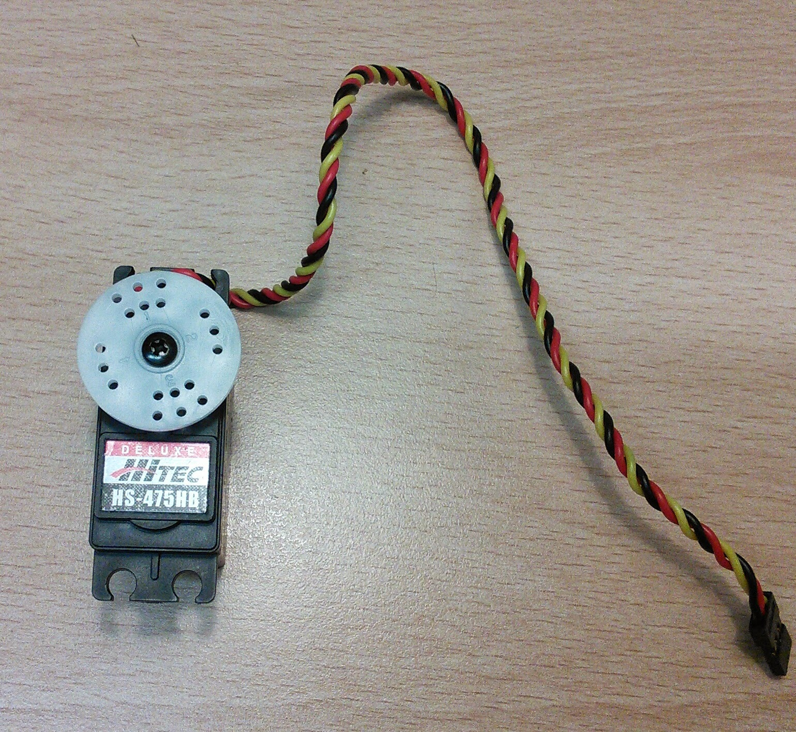</a></li>

<li>breadboard </li>

<li>1 Resistor (1 kΩ) 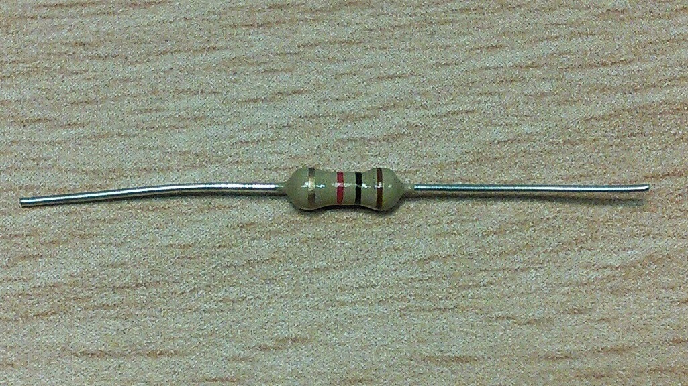</li>

<li>5 jump wires (2 male-female, 3 male-male) <a href="5_wires.jpg">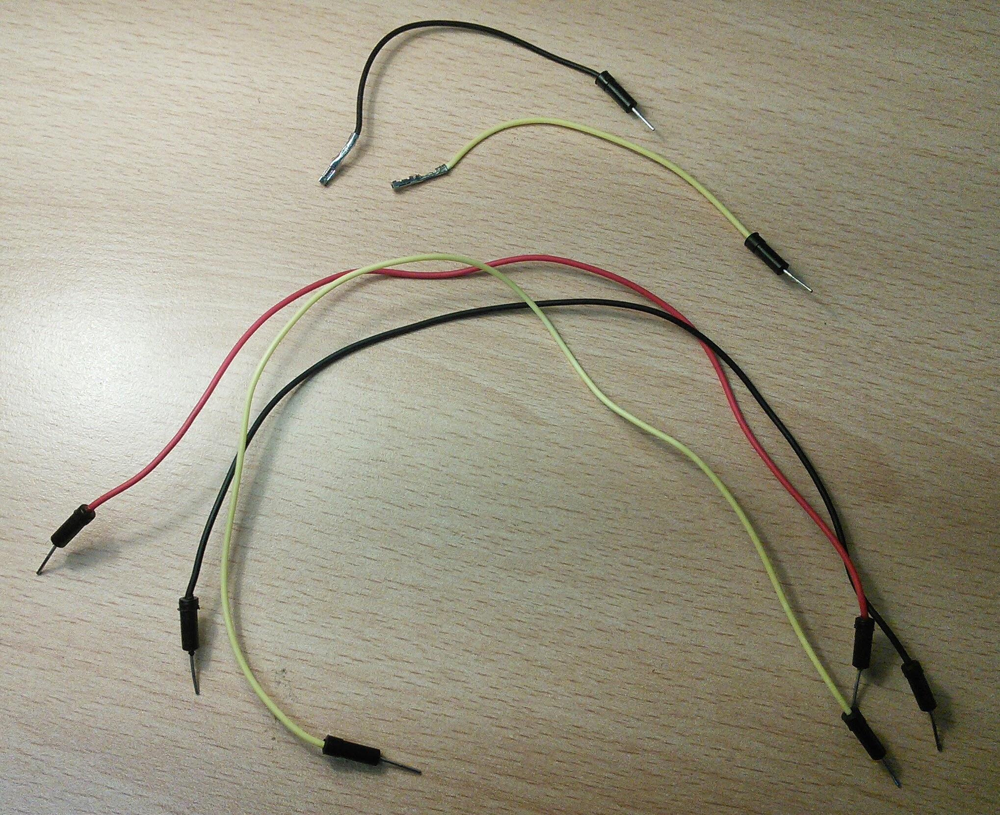</a></li>

<li>4 batteries and battery support  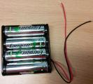</li>

</ul>
<h3>Assembly</h3>

The servo motors have three pins, two for power: red(+) and black (-), and one for control. Because the servo motor draws too much energy, we need to use the batteries to power the servo (the Raspberry Pi doesn't have so much power. if you try to use the 5V power of the raspberry pi, you may freeze your Raspberry Pi).

The red (+) of the batteries are connected to the red (+) cable of the servo, and the black (-) of the batteries are connected to the black (-) of the servo AND to the ground (-) of the Raspberry Pi. The yellow wire of the servo is connected to the resistor and the resistor is connected to the GPIO pin 1 of the Pi. 

A diagram of the circuit is shown in Figure 1:

<a href="ServoMotorBreadBoard.png">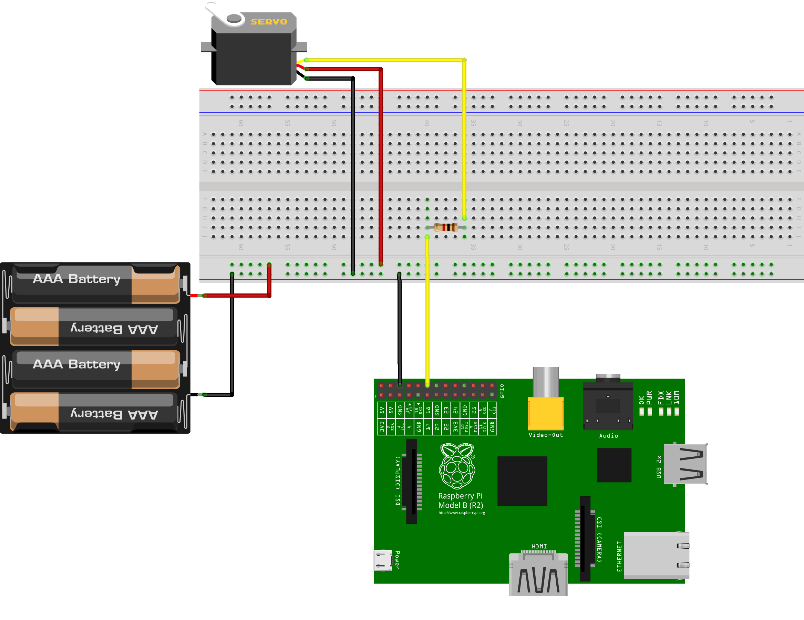</a>

<figcaption>Figure 1: Diagram of the circuit (click for larger picture).</figcaption>

It is a good idea to connect the double male wires to the servo motor:

<a href="servo_connections.jpg">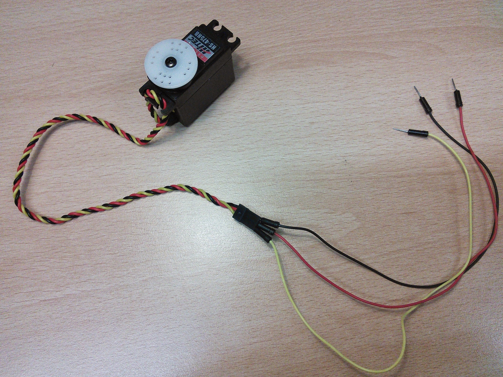</a>

<figcaption>Figure 2: Connecting the wires to the servo motor (click for larger picture).</figcaption>

<a href="servo_and_batteries.jpg">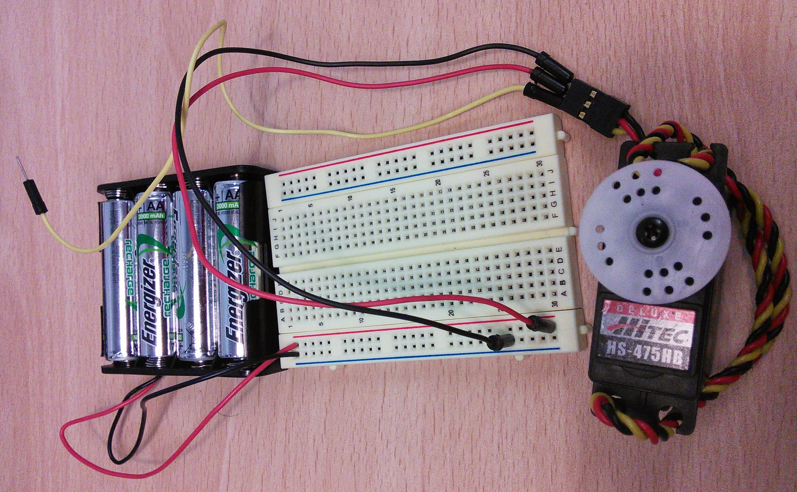</a>

<figcaption>Figure 3: Connecting the batteries to the servo (click for larger picture).</figcaption>

<a href="resitor_connection.jpg">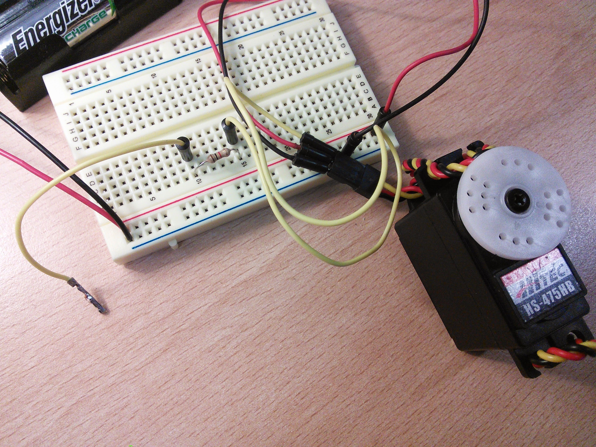</a>

<figcaption>Figure 4: Connecting the resistor (click for larger picture).</figcaption>

The Black wire should be connected to the pin number 6 (Ground) and the yellow wire should be connected to the pin number 12 (GPIO1): 

<figcaption>Figure 5: The Raspberry Pi Pins.</figcaption>

Here is how the connections should look like:

<a href="servo_motor_circuit.jpg">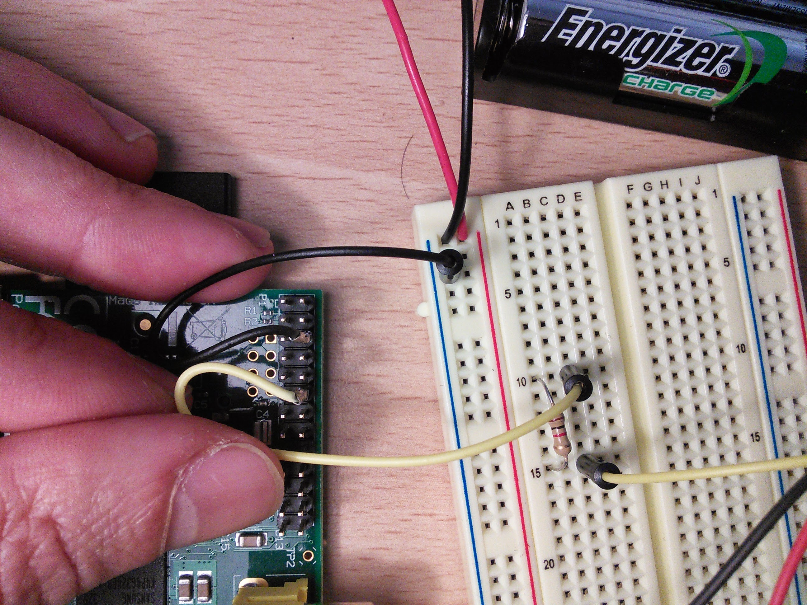</a>

<figcaption>Figure 6: Connecting the breadboard to the Raspberry Pi (click for larger picture).</figcaption>

<a href="servo_motor_final.jpg">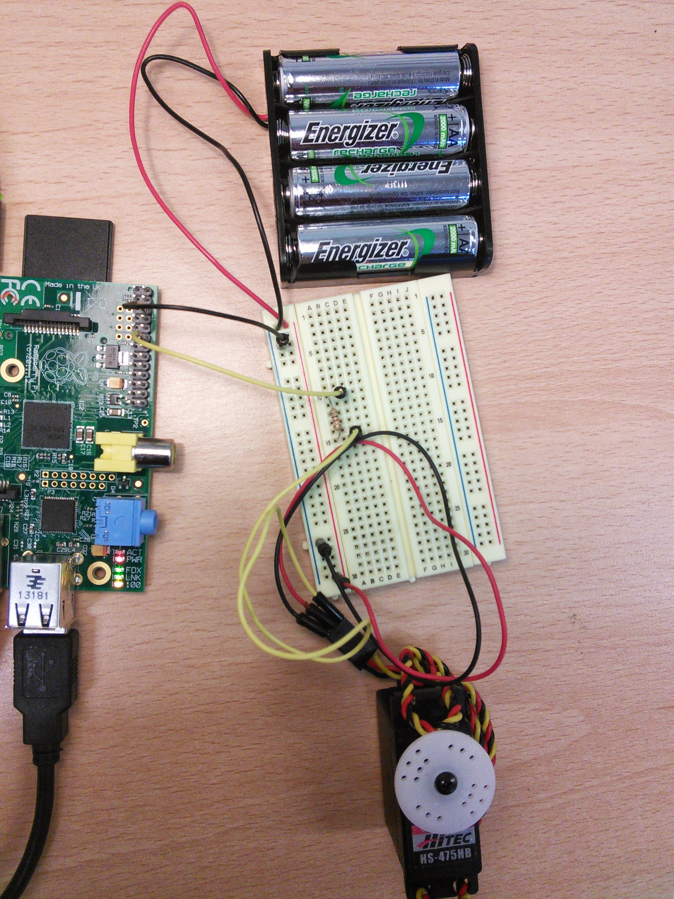</a>

<figcaption>Figure 7: The finished circuit (click for larger picture).</figcaption>

<h3>Code</h3>

In BlueJ, open the project ServoMotor. Your screen should look like this:

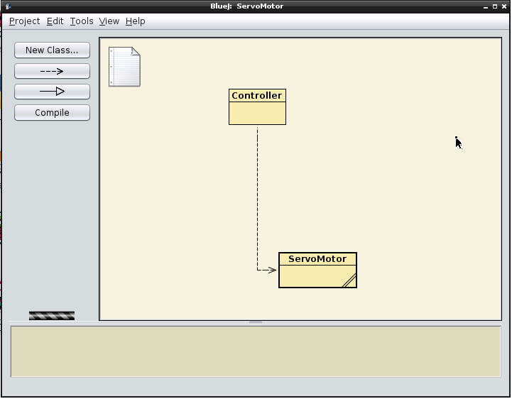

<figcaption>Figure 8: The ServoMotor project open in BlueJ.</figcaption>

Just like in the previous tutorial, each  of the yellow boxes in the BlueJ screen above is a Java class. The Servo_motor class represents a real servo motor connected to the Raspberry Pi.

            

The Controller class is a skeleton class which we will be using in this tutorial to contain code which will control  ServoMotor objects.

<h4>Creating a new ServoMotor object</h4>

Before we start to write code, we'll see how the ServoMotor class affects the real servo motor by using BlueJ to control it directly.

To start, right-click on the ServoMotor class and from the pop-up menu, choose:

<pre>new ServoMotor()</pre>

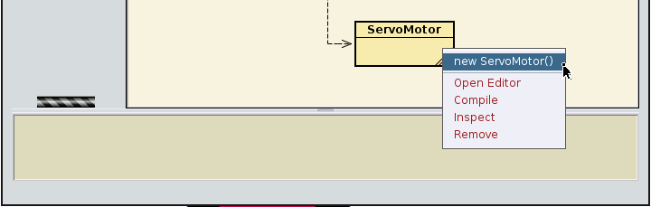

<figcaption>Figure 9: Creating an instance of ServoMotor.</figcaption>

BlueJ will ask for the "name of the instance": the suggested name is good for now. You will see a red rectangle on the bottom left of the BlueJ window named "adjustab1":

<figcaption>Figure 10: An instance of ServoMotor on the object bench.</figcaption>

This rectangular red icon represents the "servoMot1" object. This object is the Java representation of the real servo motor connected to the Raspberry Pi.

<h4>Changing position of the servo motor</h4>
The servo motor has 20 possible positions, represented by integers from 0 to 20, inclusive.
To set the ServoMotor to any of those positions, right-click on the "servoMot1" instance and select:
<pre>void setPosition(int positionNumber)</pre>

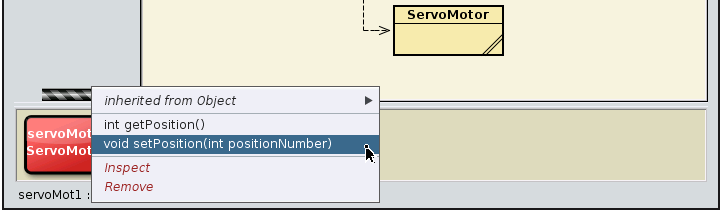

<figcaption>Figure 11: The pop-up with the list of operations on "servoMot1".</figcaption>

The positions are within the range of 0 (far left) to 20 (far right). Let's set the position to 10:

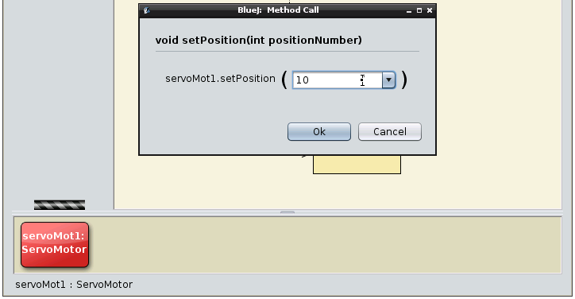

<figcaption>Figure 12: setting the position.</figcaption>

This should set the servo motor to move to the centre. (It might take a moment the first time, as all the behind-the-scenes connections are made).

<b>Tip:</b> The ServoMotor Class contains its own documentation showing all the available methods and a brief description of each of them. To see them just double click in the ServoMotor class (yellow box) and its documentation (javadoc) will show up: 

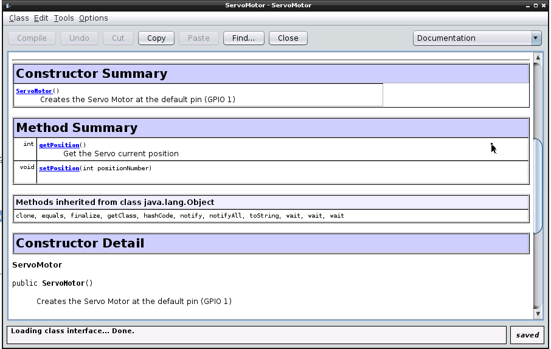

<figcaption>Figure 13: The Javadoc for the ServoMotor class.</figcaption>

<h3>Exercises: </h3>
<ul>
<li><i>Exercise 4.1</i>: You can write code in the Controller class to do more things with your servo motor. In the Controller class, change the body of the method "void moveRight()" to move the servo motor one position to the right.

Tips: 
<ul>
<li>To edit the Controller class, double click on the "Controller" yellow box and you will see the source code for the Controller class.

<li> <b>Important:</b> before testing the changes you make to the Controller class, do not forget to compile your project by clicking on "Compile" on the top left of your editor or on the left panel of the BlueJ main screen:

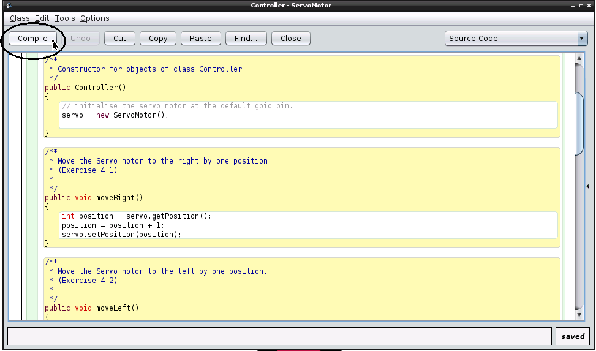

<figcaption>Figure 14: Controller class: Click on the <i>Compile</i> button before testing.</figcaption>

</li>
</li>

<li>To test the changes in your Controller class, make an instance of the Controller by right-clicking on the class, just like we did with the ServoMotor class, and then  right-clicking on the red Controller instance to call the methods you have just changed. </li>
</ul>
</li>

<li><i>Exercise 4.2</i>: In the Controller class, change the body of the method "void moveLeft()" to move the servo motor one position to the left.</li>

<li><i>Exercise 4.3</i>: In the Controller class, change the body of the method "void moveTo(int position)" to move the servo motor to a position given by the user. Tip: check if the position is a valid one.</li>

<li><i>Exercise 4.4</i>: Magic 8 ball is a guessing toy commonly used in movies, where someone asks a question and the ball randomly select one answer from its pool of answers. In this exercise, we will create our version of the magic 8 ball. To do so, download <a href="https://github.com/bluejteam/RasbperryPiTutorials/raw/master/Eight Ball.pdf">this sheet</a> and print it. Position the servo motor on the central cross, and use a sellotape to fix a pointer to the motor (you can use a straw, for example). Then change the body of the method "eightBall()" in the Controller class to select a random number (for example, from 0 to 9 ), and then move the servo motor to that position, where you can read the magic eight ball guess. Try some funny questions and see if the magic 8 ball gives you funny or improbable answers.

 Tip: The Controller class has the method:
<pre>int generateRandomNumber(int max)</pre>
This method returns an integer from 0 to max. Use this method in order to help you creating your magic 8 ball.</li>

<li><i>Exercise 4.5</i>: Guess game: Implement the method "guessGame(int numberOfGuesses)" in order to calculate a random number using int generateRandomNumber(int max), then ask the user for a number. If the number entered by the user is lower than the random number, make the servo motor wiggle to the right. If the number is higher, then make the servo wiggle to left. The parameter numberOfGuesses is the number of times the user can try to guess the number before loosing.
 

Tip: In order to wiggle, you may want to move the servo motor, then wait a little bit before moving it back. You may want to use the following method in the Controller class:
<pre>sleepMillisec(int time)</pre>

This method can be used in order to make your program wait a given number of milliseconds.

Be aware: 1 millisecond is a very short time.</li>
</ul>

<a href="PWMLed.md">Previous tutorial</a>

<a href="README.md"> Back to the index</a>

<!-- jQuery (necessary for Bootstrap's JavaScript plugins) -->

<!-- Include all compiled plugins (below), or include individual files as needed -->

</body>
</html>
