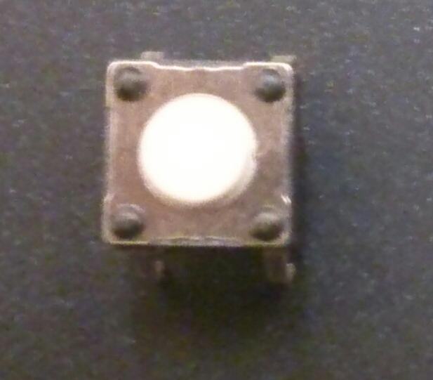
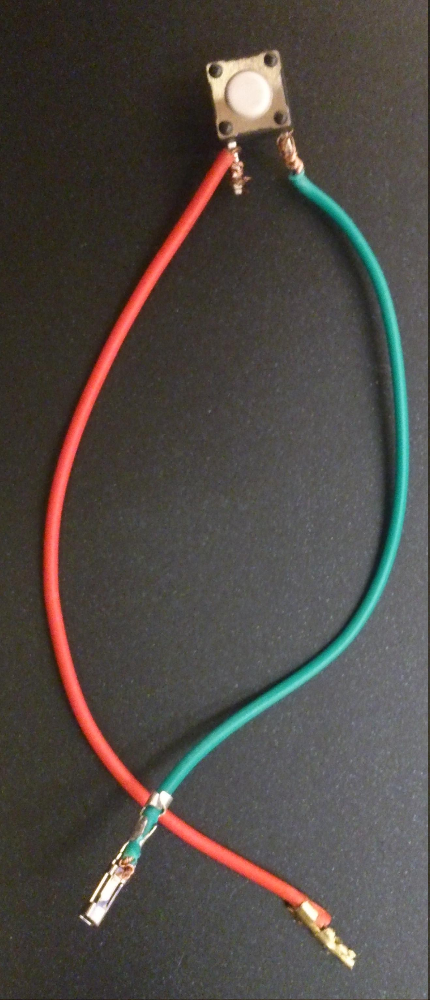
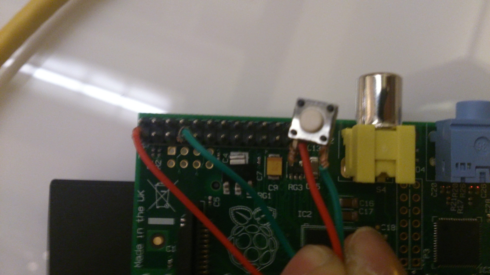
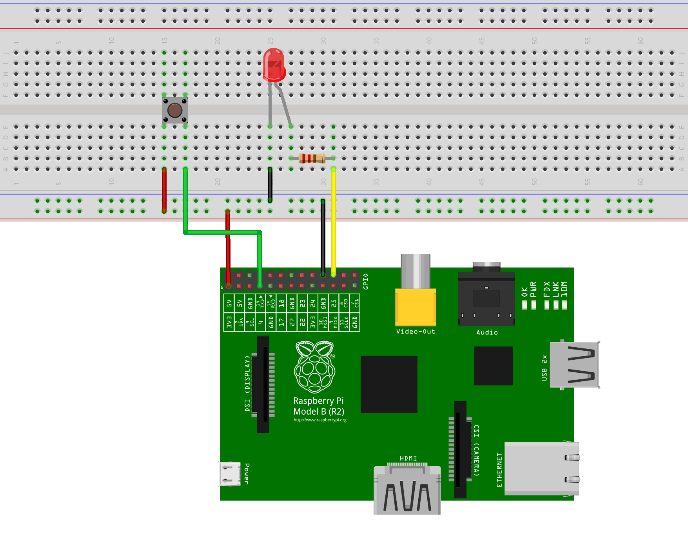
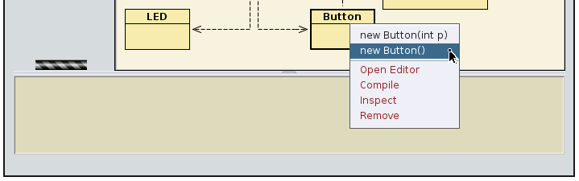
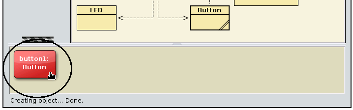
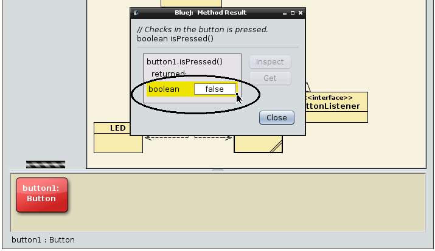
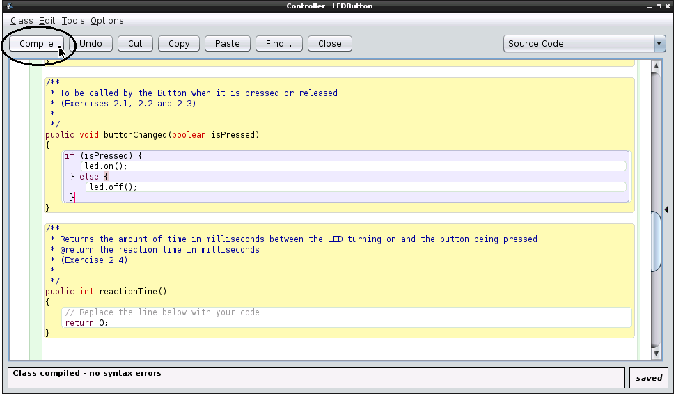
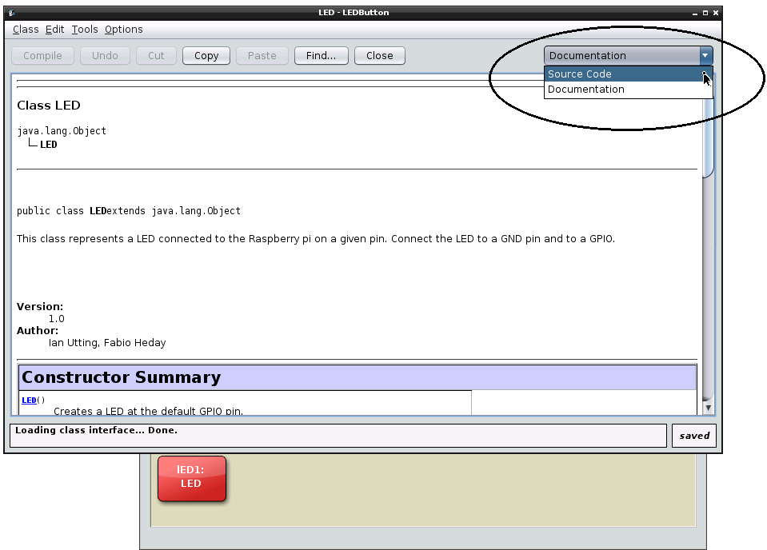

<h1 align="center"> Button Tutorial </h1>
<h2>Section 2: Reading the button state</h2>

In this section, we will connect a button to a Raspberry Pi and use a GPIO input pin to read its state (pressed and not pressed); first using BlueJ interactively, then programatically by writing code in the Controller class.
<h3>Material</h3>

For this experiment, you will need:

<ul>
<li>1 Button </li>

<li>2 wires </li>

<li>a breadboard  *optional</li>
</ul>
<h3>Assembly</h3>

Connect the wires to the button as depicted in Figure 1:

<figcaption>Figure 1: connecting the button wires.</figcaption>

Now connect the wires to the pins 1 (3.3V) and 7 (GPIO7) (Using the marks in Figure 2, below). A button, unlike an LED, is a component that has no <em>polarity</em>, i.e., it doesn't matter which wire you connect to which pin.

<figcaption>Figure 2: The Raspberry Pi Pins.</figcaption>

<b>Note:</b> If you have a Raspberry Pi model B+, you will have more than 26 pins. However, the assignment for those pins present on both models (B and B+) will still be the same as described here and the project should work without change.
</a>

 Figure 3 shows the assembly (note: we removed the LED connections so you can see what we've done. You will need the LED connected for the next part of this project):

<figcaption>Figure 3: connecting the button wires (click for larger picture).</figcaption>
            

<h4>With a breadboard</h4>

If you have a breadboard of any size available, we recommend using it to build the circuit. You can add the button to the previous assemby:
The circuit is shown in Figure 4, below:

<figcaption>Figure 4: Using a breadboard (click for larger picture).</figcaption>

<h3>Code</h3>
In this session we will use the Button class to find out if the button is being pressed or released.

<h4>Creating a new Button object</h4>

Just like the LED class, we first need to instantiate the Button class.

 In order to do so, we first right-click on the Button class and from the pop-up menu, choose:

<pre>new Button()</pre>

<figcaption>Figure 5: Creating a new instance of Button.</figcaption>

BlueJ will ask for the "name of the instance": the suggested name is good for now. You will see a red rectangle on the bottom left of the BlueJ window named "button1":

<figcaption>Figure 6: An instance of Button on the object bench.</figcaption>

<h4>Checking the current state of the button</h4>

Right-click on the "button1" instance and select the "boolean isPressed()" method:

<figcaption>Figure 7: Selecting the "boolean isPressed()" method.</figcaption>

You should get a message saying that "button1.isPressed()" returned "false" (see Figure 8). Indeed, the button wasn't pressed when we called this method.

<figcaption>Figure 8: The result of "boolean isPressed()" method when the button is not being pressed.</figcaption>

Find out what  happens if you have the button pressed while calling the "boolean isPressed()" method.

<h4>Listen to the button!</h4>

We just learnt how to ask the button what is its current state. However, to keep actively asking the button object if it was being pressed is not very efficient and consumes precious processing power on the Raspberry Pi’s without doing much. This technique, where a device (button) is continuously being asked its status is known as 'polling'.

However, instead of polling the button state, there is a  mechanism (common in Java and called a Listener) to have a method called whenever the button is pressed or released.

This mechanism has already been partly implemented in our project, with a method in the Controller called "void buttonChanged(boolean isPressed)". Whenever you create an instance of the Controller class, and the button is pressed (or released) this method is automatically called. The parameter "isPressed" tell us if the button has just been pressed (true) or released (false).

So, whenever we want to make the Controller class do something when the button is pressed, we just need to put this behaviour inside the buttonChanged method.

<h3>Exercises</h3>
<ul>
<li><i>Exercise 2.1</i>: Push button: Complete the body of the method "void buttonChanged(boolean isPressed)" in the Controller class so that when it is called, it turns the LED on if the button is pressed and  turns it off if the button is released.</li>

Tips: 
<ul>
<li>To edit the Controller class, double click on the "Controller" yellow box and you will see the source code for the Controller class.

<li> <b>Important:</b> before testing the changes you make to the Controller class, do not forget to compile your project by clicking on "Compile" on the top left of your editor or on the left panel of the BlueJ main screen:

<figcaption>Figure 9: Controller class: Click on the <i>Compile</i> button before testing.</figcaption>

</li>
</li>

<li>To test the changes in your Controller class, make an instance of the Controller by right-clicking on the class, just like we did with the LED class, and then  right-clicking on the red Controller instance to call the methods you have just changed. </li>
</ul>
</li>

<li><i>Exercise 2.2</i>: Toggle button: Change the method "void buttonChanged(boolean isPressed)" in the Controller class so that when  the button is pressed it will turn the LED on if it is currently off, and off if it is currently on.

Tip: You may want to add a boolean variable in the Controller class to remember the current state of the LED.

</li>

<li><i>Exercise 2.3</i>: Change the "void buttonChanged(boolean isPressed)" to measure how fast you can press and then release the button:

Tip:

<ul>
<li>The method "public int timeNow()" in the Controller class will return the amount of time (in milliseconds) since the program started running. Use it as a clock in order to find out how much time as passed between events.
</li>
<li>You may need to add an int variable to the Controller class to keep track of the time.</li>
</ul>

<li>
<i>Exercise 2.4</i>: Reaction timer: Implement the method "int reactionTime()" in the Controller class and change the method "void buttonChange(boolean isPressed)" in order to make the led turn on after a random short delay and then measure the time until you press the button. Your reactionTime() method can then calculate and return the time difference between when the LED was turned on and when the button was pressed.
 

If a method called interactively by the user returns a value, then BlueJ will show this value to the user. Alternatively, your can also use System.out.println if you want to keep a record of the times. Compare your times with your friends and see who is faster in pressing the button.
</li>
</ul>

<h3 id="UnderTheHood">Under the hood:</h3>
If you want to know more about how the LED and Button classes use GPIO to control the LED and react to Button presses, there's a lot more information in the comments in the code. To see the code of the LED or Button class,  double click on the Class yellow box, then select "Source Code":

  

  
<figcaption>Figure 10: Displaying the code for the LED class.</figcaption>

You can use these two classes as a starting point for controlling other devices using GPIO input and output pins. For all the details of how they work and the way you can access them from Java,  visit the <a href="http://pi4j.com/usage.html">Pi4J website</a> and the <a href='http://pi4j.com/apidocs/index.html'>Pi4J library documentation</a>.      

<a href="PWMLed.md">Next tutorial</a>

<a href="led.md">Previous tutorial</a>

<a href="README.md"> Back to the index</a>

	
<!-- jQuery (necessary for Bootstrap's JavaScript plugins) -->

<!-- Include all compiled plugins (below), or include individual files as needed -->

</body>
</html>
