<h1 align="center"> BlueJ - LED Tutorial</h1>
<h2 align="center"> LED Tutorial </h>

This tutorial describes how to use BlueJ on the Raspberry Pi to to interact with simple electronics using the Pi's GPIO pins (General-Purpose Input/Output pins). It is not intended to be a complete description of how to use the pins: for that, see the sections called <a href="button.md#UnderTheHood">Under the Hood</a>.

The tutorial is divided into two parts. In the first we'll look at output and lighting an LED, in the second we'll look at input from a button.

If you have not got BlueJ installed in your Raspberry Pi, please install it by following the instructions <a href="http://bluej.org/raspberrypi/index.html#installation">here</a>.

<h2>Section 1: Interacting with a LED</h2>

In this section, we will connect a LED to a Raspberry Pi and turn it on and off by direct object manipulation using BlueJ.  This tutorial will make use of the project <a href="https://github.com/bluejteam/RasbperryPiTutorials/raw/master/projects/LEDButton.zip">LEDButton</a>, which you should  download and open in  BlueJ running on the Raspberry Pi.

<h3>Material</h3>

For this experiment, you will need:

<ul>
<li>1 LED 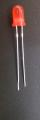</li>

<li>1 Resistor (any value between 270Ω to 330Ω) 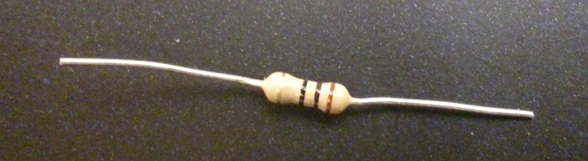</li>

<li>2 wires 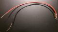</li>

<li>a breadboard 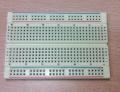 *optional</li>
</ul>

<h3>Assembly</h3>
<h4>Without a breadboard</h4>

An LED is a component that emits light whenever there is a current flowing through it. It will have one long leg and one  shorter one. The short leg (ground terminal) should be connected directly to the black wire and the longer leg should be connected to your resistor. The resistor is used  to limit the current flowing and prevent the LED from burning out.

The other leg of the resistor should be connected to the other wire (the red one), as  in the following picture:

<a href="led_and_resistor.JPG">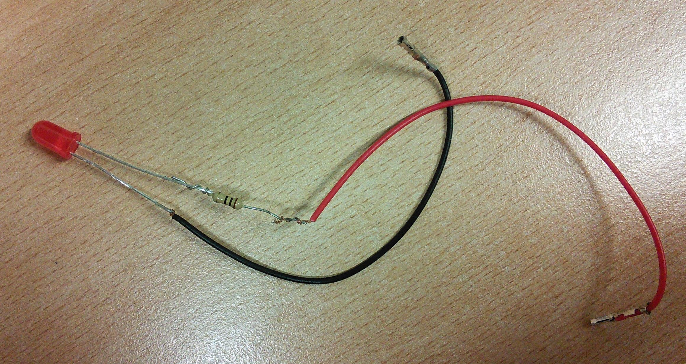</a>

<figcaption>Figure 1: connecting the LED to the resistor (click for larger picture).</figcaption>

The Black wire should then be connected to the pin marked 20 (Ground) on your Pi and the red wire should be connected to the pin marked 22 (GPIO6): 

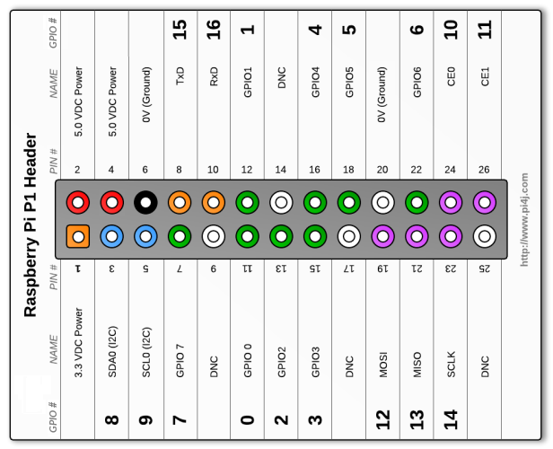

 <figcaption>Figure 2: The Raspberry Pi Pins.</figcaption>

<b>Note:</b> If you have a Raspberry Pi model B+, you will have more than 26 pins. However, the assignment for those pins present on both models (B and B+) will still be the same as described here and the project should work without change.
</a>

Here is what your  circuit should look like:

<a href="led_connected_to_raspberrypi.jpg">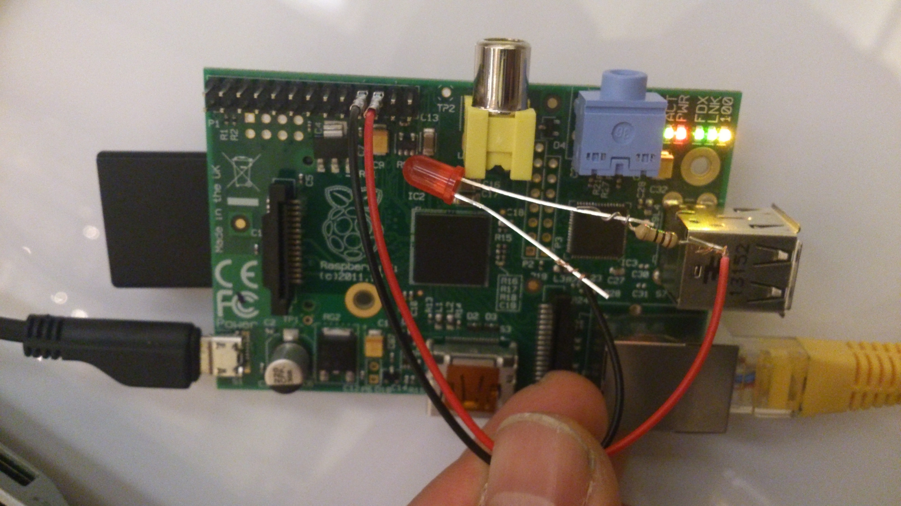</a>

<figcaption>Figure 3: Connection to the Raspberry Pi.</figcaption>

<h4>With a breadboard</h4>

If you have a breadboard of any size available, we recommend using it to build the circuit. Don't forget to get the legs of the LED the right way round! 
The circuit is shown in Figure 4, below:

<figcaption>Figure 4: Using a breadboard (click for larger picture).</figcaption>

<h3>Code</h3>

In BlueJ, open the project LEDButton. Your screen should look like this:

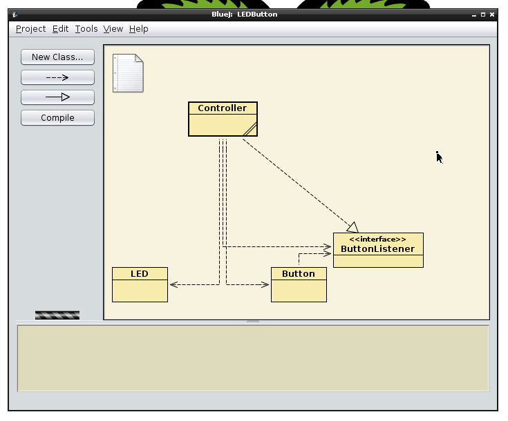

<figcaption>Figure 5: The LED and Button project open in BlueJ.</figcaption>

Each  of the yellow boxes in the BlueJ screen above is a Java class. The LED class represents the real LED connected to the Raspberry Pi.

The LED, Button and ButtonListener classes are already made and you can use them in the following exercises, but do not change them. The Controller class is where you will write your own code. The Button and ButtonListener classes will be described in Part 2 of this tutorial.

<h4>Creating a new LED object</h4>

Before we start to write code, we'll see how the LED class affects the real LED by using BlueJ to control it directly.

To start, right-click on the LED class and from the pop-up menu, choose:

<pre>new LED()</pre>

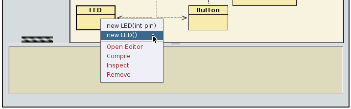

<figcaption>Figure 6: Creating an instance of LED.</figcaption>

BlueJ will ask for the "name of the instance": the suggested name is good for now. You will see a red rectangle on the bottom left of the BlueJ window named "lED1":

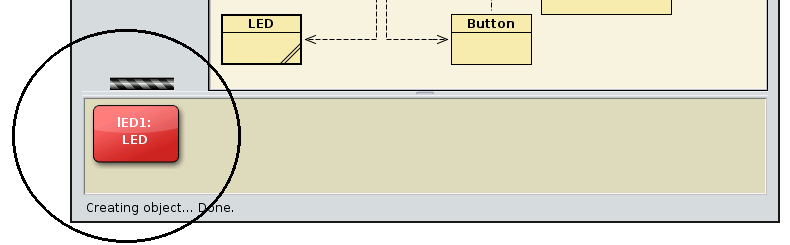

<figcaption>Figure 7: An instance of LED on the object bench.</figcaption>

This rectangular red icon represents the "lED1" object. This object is the Java representation of the real LED connected to the Raspberry Pi.

<h4>Turning the LED on</h4>
To turn the LED on, right-click on the "lED1" instance and select:
<pre>void on()</pre>

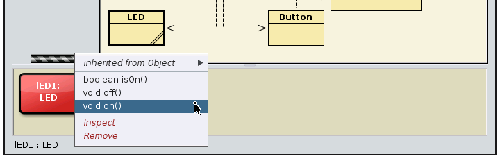

<figcaption>Figure 8: The pop-up with the list of operations on "lED1".</figcaption>

This should turn on the LED. (It might take a moment the first time, as all the behind-the-scenes connections are made).

If you look at Figure 6, you can see that we can also create a LED specifying a gpio number. We didn't need to do that because the default gpio number is the gpio number 6, where we connected our LED.

<b>Tip:</b> The LED  Class contains its own documentation showing all the available methods and a brief description of each of them. To see them just double click in the LED class (yellow box) and its documentation (javadoc) will show up: 

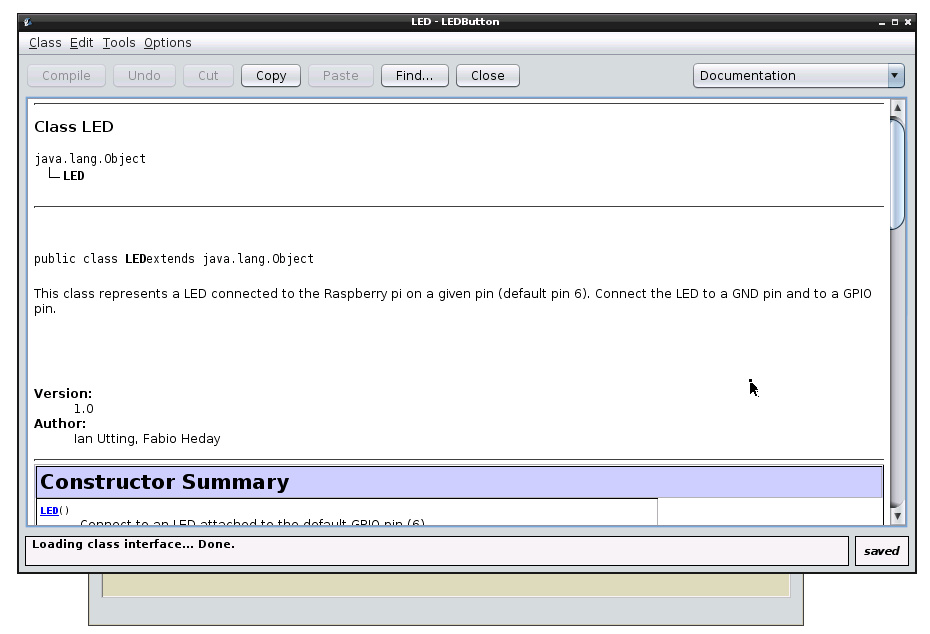

<figcaption>Figure 9: The Javadoc for the LED class.</figcaption>

  
<h3>Exercises: </h3>
<ul>
<li><i>Exercise 1.1</i>: You have turned the LED on. Can you turn it off now?

</li>
<li><i>Exercise 1.2</i>: You can write code in the Controller class to do what you have just done interactively. In the Controller class, change the body of the method "void turnLEDOn()" to call the method which will turn the LED on, and likewise change the method "void turnLEDOff()" in the same class to turn the LED off.

Tips: 
<ul>
<li>To edit the Controller class, double click on the "Controller" yellow box and you will see the source code for the Controller class.

<li> In the Controller class, the LED object is called 'led': it is already there for you!
</li>

<li> <b>Important:</b> before testing the changes you make to the Controller class, do not forget to compile your project by clicking on "Compile" on the top left of your editor or on the left panel of the BlueJ main screen:

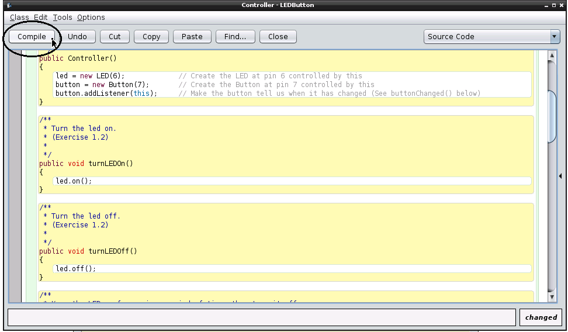

<figcaption>Figure 10: Controller class: Click on the <i>Compile</i> button before testing.</figcaption>

</li>
</li>

<li>To test the changes in your Controller class, make an instance of the Controller by right-clicking on the class, just like we did with the LED class, and then  right-clicking on the red Controller instance to call the methods you have just changed. </li>
</ul>
</li>

<li><i>Exercise 1.3</i>: Change the body of the method "void flash(int time)" in the Controller class to keep the LED on for a given amount of time (measured in milliseconds), then turn the LED off.

Tips:
<ul>

<li>The Controller class has a method called
<pre>sleepMillisec(int time)</pre>
This method can be used in order to make your program wait a given number of milliseconds.

1 millisecond is a very short time.</li>
</li></ul>

<li><i>Exercise 1.4</i>: Change the body of the method "void flashSOS()" in order to make the LED flash the morse code for SOS.

Tip:
<ul>
<li>
The morse code for SOS is: ". . . - - - . . .", where a dot (.) is a brief flash and a dash (-) is a longer flash
</li>
<li>

Make use of the flash method implemented in the previous exercise.</li>
</ul>
<li><i>Exercise 1.5</i>: Find out all the patterns Morse Code uses, and write a new method for the Controller class which flashes out any string you give it in Morse Code.</li>
</ul>

<a href="button.md">Next tutorial</a>

<a href="README.md"> Back to the index</a>

<!-- jQuery (necessary for Bootstrap's JavaScript plugins) -->

<!-- Include all compiled plugins (below), or include individual files as needed -->

